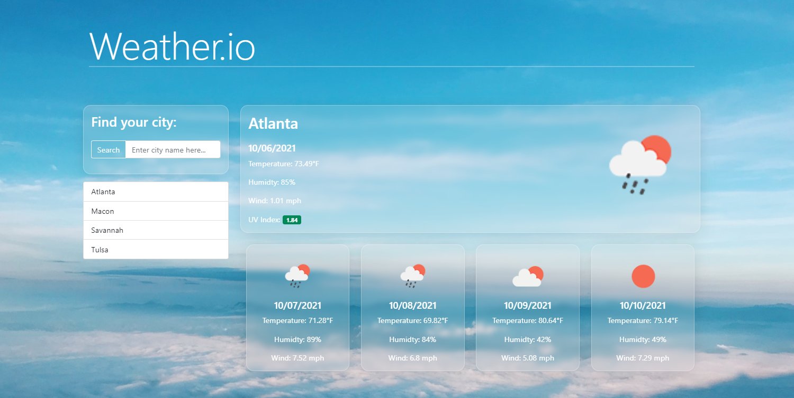

# weather-dashboard-app

Weather Dashboard App created with Bootstrap and OpenWeather Api 

For this project, I was tasked with creating a Weather Dashboard App using Bootstrap and the OpenWeather Api. The app displays the date, weather conditions and a visiual representation of the conditions for the current day, as well as a 5-day forecast. The user is able to search for a city, then the search history is pushed to local storage and rendered as buttons which can be called at any time. 

https://jacobmabob.github.io/weather-dashboard-app/

